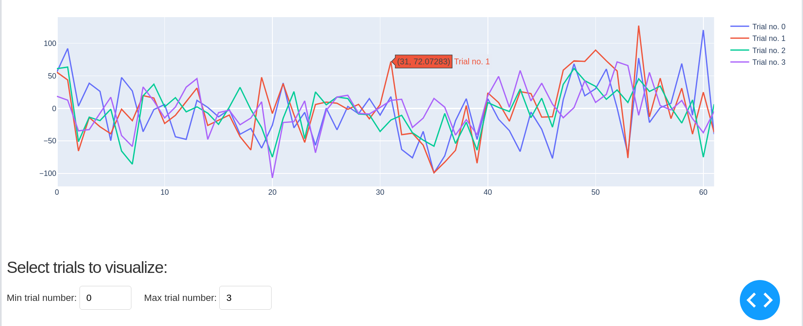

# brain-networks-dash-app
A Dash app for analyzing a data set containing brain network information.

This is a small project for me to get used to Plotly and Dash.

This is what it looks like so far:

